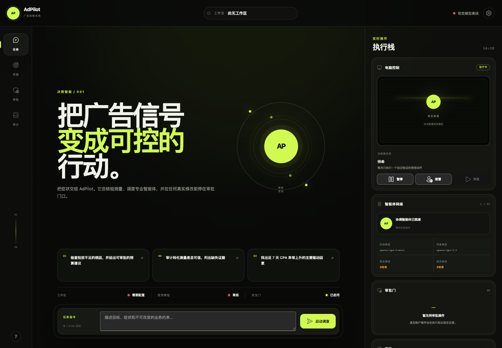

# AdPilot

AdPilot 是一个可本地运行、可审批、可审计的原生广告优化 Agent。Pi 是唯一主运行时；UI-TARS 只负责“截图到单个视觉动作”的 grounding；广告策略、成熟度、测量可信度、预算/出价安全门和 UAC 实验闭环由确定性内核执行。



## 当前能力

- 一个面向用户的 AdPilot Agent，按调查树调度 Account Operator、Performance Analyst、Media Buyer、Measurement Reviewer、Creative Strategist 和独立 Risk Reviewer。
- 客户隔离 Workspace，保存任务、证据、截图、审计链、审批、实验、报告和记忆。
- Fast / Strong / GUI 三层模型路由；设置页直接读取 Pi 0.80.10 的完整目录（当前 36 个供应商、1,072 个静态模型条目），同时支持 API 密钥与 Pi 原生 OAuth。模型只做推理，Skill 定义流程，Tool 才能触碰本地数据或界面。
- 原生 Computer Use：每次严格执行 `截图 -> 单步 grounding -> 策略检查 -> 原生动作 -> 再截图 -> 结果验证`。
- 真实修改必须经过确定性 guardrail、Risk Reviewer、用户批准和五分钟一次性令牌；令牌绑定账户、Campaign、操作和前后值。
- Google App Campaign 的规范化、诊断、版本化数值策略、实验账本、doctor 和历史回放内核；保留 410 项上游契约测试。
- React + Fluent UI 控制台、SSE 实时状态、CLI、本地 mock 广告后台和失败关闭测试。

## 安装

需要 Node.js 22+、pnpm 10+、Git。若要运行 UAC Python 契约测试，还需要 Python 3.10+。

```bash
git clone --recurse-submodules <your-adpilot-repository> adpilot
cd adpilot
corepack enable
pnpm install --frozen-lockfile
pnpm build
npm install --global .
```

`npm install --global .` 会把已经构建好的 `adpilot` 命令安装到当前 Node 的全局 bin。开发时如果希望源码目录中的每次构建立刻生效，也可以改用 `pnpm link --global`。验证安装：

```bash
which adpilot
adpilot doctor
```

创建第一个客户 Workspace：

```bash
adpilot init demo-client --name "Demo Client" --kpi CPA --target 20 --currency USD
```

启动后点右上角齿轮进入“设置”。“模型”页可以选择 Fast/Strong 路由并配置供应商 API 密钥或 OAuth；“电脑控制”页配置 UI-TARS 兼容端点。保存后按提示重启即可生效。密钥不会由设置接口返回明文。

CLI 同样能查看 Pi 供应商并完成 OAuth 登录；CLI 和 DMG 共用各自活动 Workspace 内的安全凭据格式：

```bash
adpilot providers
adpilot login openai-codex
adpilot logout openai-codex
```

自动化部署仍可复制 `.env.example` 为 `.env` 或设置同名环境变量。设置页保存的值优先于启动时环境变量。

```bash
adpilot doctor
adpilot
```

默认服务仅监听 `127.0.0.1:4317` 并打开控制台。可用 `ADPILOT_HOST`、`ADPILOT_PORT`、`ADPILOT_WORKSPACE` 和 `ADPILOT_NO_OPEN=1` 调整。

## 原生 macOS 应用与 DMG

仓库包含独立 Electron 主进程。它在随机回环端口启动同一套 AdPilot API，使用隔离浏览器上下文，并把默认 Workspace 放在 `~/Library/Application Support/AdPilot/workspace`。开发启动：

```bash
pnpm desktop
```

先生成并验证未封装的 `.app`：

```bash
pnpm desktop:dir
open release/mac-arm64/AdPilot.app
```

生成可安装 DMG：

```bash
pnpm desktop:dmg
open release/AdPilot-0.1.0-arm64.dmg
```

DMG 会使用 `build/icon.icns` 和标准拖拽到 Applications 的安装窗口。`pnpm icon:mac` 可从 `build/icon.svg` 重建图标。未签名 DMG 适合本机测试；对外分发前仍需配置 Apple Developer ID 签名与 notarization。原生应用的设置和 OAuth 凭据分别保存在 `~/Library/Application Support/AdPilot/workspace/.adpilot/settings.json` 与 `pi-auth.json`，文件权限为 `0600`；它也会读取 `~/Library/Application Support/AdPilot/.env` 和系统环境变量。

## macOS 权限

原生 Computer Use 需要给实际启动 `adpilot` 的 Terminal/运行器，或打包后的 `AdPilot.app`，授予“辅助功能”和“屏幕录制”权限。建议使用独立浏览器 Profile，只登录获授权的广告账户，并在客户 `accounts.yaml` 中限制应用与域名。未配置 GUI 模型时，产品仍可做分析，但不会执行视觉任务。

## 验证

```bash
pnpm test
python3 -m pip install -r packages/advertising-core/python/requirements-dev.txt
pnpm test:ads-core
pnpm check
```

本地视觉闭环使用 `apps/mock-ad-dashboard/index.html`，不会连接真实广告平台。架构边界见 [docs/architecture.md](docs/architecture.md)，模型配置见 [docs/model-configuration.md](docs/model-configuration.md)，Computer Use 权限见 [docs/computer-use-permissions.md](docs/computer-use-permissions.md)，安全模型见 [docs/security.md](docs/security.md)，上游升级流程见 [docs/upstream-sync.md](docs/upstream-sync.md)。测试结果和已知外部限制分别见 [docs/test-report.md](docs/test-report.md) 与 [docs/known-limitations.md](docs/known-limitations.md)。

第三方署名与许可证见 [THIRD_PARTY_NOTICES.md](THIRD_PARTY_NOTICES.md)。

## English quick start

AdPilot is a local-first, approval-gated advertising optimization agent. Install with Node 22 and pnpm, run `pnpm install --frozen-lockfile && pnpm build && npm install --global .`, create a workspace with `adpilot init`, then launch with `adpilot`. Settings expose the complete Pi provider catalog, API-key and OAuth connections, model routing, UI language, appearance, and UI-TARS configuration. No live mutation can bypass deterministic policy, independent risk review, user approval, and a one-time bound token.
